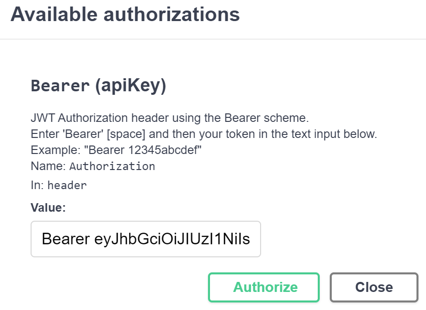

# Gastos_webapi
## Motivació

Aquest projecte sorgeix amb l'objectiu que l'aplicació per a mòbil que he desenvolupat, [Dot Parpel Gastos](https://play.google.com/store/apps/details?id=cat.dotparpel.gastos), que fins al moment guarda tota la informació en local en una BD *SQLite*, pugui treballar amb dades en servidor a través d'un WebApi. A l'hora d'escriure aquest document, l'aplicació encara no està preparada per utilitzar la WebApi.

## Tecnologies usades

Aquesta WebApi utilitza les següents tecnologies:

| <!-- --> | Tecnología | 
|-|-|
| Llenguatge | C# (Net Core 7) |
| Bases de dades | PostgreSQL o SQL-Server<br> InMemory (proves)<br> SQLite (només per a importació / exportació de dades) |
| Descripció de la WebApi | Swagger / OpenApi |
| Accés a dades | OData |
| Autenticació | JwtBearer (opcional) |
| *Framework* de proves | xUnit |

## Entorn de desenvolupament

Per al desenvolupament de l'aplicació s'ha fet servir::
| <!-- --> | Tecnologia | 
|-|-|
| Sistemes operatius | Windows 10, Windows 11, Linux Mint 21 |
| Contenidor | Docker (bases de dades de desenvolupament PosgreSQL / SQL-Server) |
| Entorn de desenvolupament | Visual Studio Code, amb les següents extensions:<br>- [C#](https://marketplace.visualstudio.com/items?itemName=ms-dotnettools.csharp) <br>- [.NET Core Test Explorer](https://marketplace.visualstudio.com/items?itemName=formulahendry.dotnet-test-explorer)<br>- [Coverage Gutters](https://marketplace.visualstudio.com/items?itemName=ryanluker.vscode-coverage-gutters)<br> - [vscode-solution-explorer](https://marketplace.visualstudio.com/items?itemName=fernandoescolar.vscode-solution-explorer) |

Per seleccionar aquestes eines les motivacions han estat:
- Ús d'estàndards consolidats i multiplataforma sempre que sigui possible
- Disponibilitat de les eines de desenvolupament sense cost
- Ús baix de recursos a la plataforma de desplegament destí
     - En particular, l'aplicació destí haurà de poder desplegar-se i executar-se en una Raspberry 4*

## Objectius
L'objectiu inicial ha estat, tal com s'explica a l'apartat motivació, donar suport a l'aplicació [Dot Parpel Gastos](https://play.google.com/store/apps/details?id=cat.dotparpel.gastos) perquè pugui treballar amb dades al servidor.

Com a objectius secundaris però no per això menys rellevants:
- Facilitat d'ús de la WebApi
- En la mesura del possible, que la WebApi s'autoexpliqui i permeti proves (mitjançant *Swagger*)
- Proporcionar exemples d'ús de la WebApi a la pròpia pàgina *Swagger*
- Addició de noves entitats amb (relativa) facilitat

Amb aquests objectius al cap, l'aplicació resultant presenta l'aspecte següent:


## Descripció
La WebApi proporciona les següents funcionalitats:
* CRUD per a entitats, en el projecte `Category` i `Expense`, acceptant consultes OData en el mètode de lectura de llistes (GET)
* Entitats únicament de lectura de llistes (`ExpenseExpanded` i `ExpenseReport`), sovint usades per a la presentació d'informació en desplegables, llistes o informes
* Controlador `App` amb funcionalitat pròpia de gestió i seguretat de l'aplicació. Proporciona els següents mètodes:
  - `login`: únicament visible amb la seguretat activada (veure l'apartat [Configuració](#ConfiguracionId) més endavant), permet la introducció de credencials i obtenir, en cas que siguin vàlides, un *token* d'accés i un *token* de refresc necessaris per usar la WebApi
  - `refreshToken`: únicament visible amb la seguretat activada, permet renovar un *token* d'accés caducat proporcionant un *token* de refresc. Típicament es fa servir per evitar enviar les credencials d'usuari un cop caduqui el *token* d'accés
  - `logout`: únicament visible amb la seguretat activada, indica a la WebApi que l'usuari acaba la sessió
  - `import`: importació de taules proporcionant una base de dades *SQLite*. Perquè la importació es produeixi correctament, el nom i l'estructura de la taula a importar ha de tenir el mateix nom i estructura a la base de dades destinació, a més de constar en el paràmetre `ExportEntities`. Cal destacar que **les dades de la taula destinació seran <ins>substituïdes</ins> pels proporcionats a la base de dades *SQLite***
  - `export`: exportació del contingut de la base de dades de WebApi a una base de dades SQLite. Només s'exporten les taules indicades al paràmetre `ExportEntities` de l'apartat `App` del fitxer `appsettings.json`
  - `version`: retorna el nombre de versió de la WebApi. Cal tenir present que el nombre de versió del programa no ha de coincidir amb la versió de la interfície. Usat en determinats entorns per comprovar si la WebApi està disponible (per exemple, prova de servei alçat amb *Nagios*)
* Controlador `User`: permet la gestió d'usuaris autoritzats a usar la WebApi. Per defecte no és accesible, tot i que es pot activar explícitament a través de la configuració de `appsettings.json`

Inicialment, l'entorn de desenvolupament (configurat a `appsettings.Development.json`) es proporciona amb la **seguretat desactivada**, de manera que es permet l'execució dels mètodes de WebApi sense haver d'introduir credencials.
<br/><br/>
Per poder realitzar proves immediatament, es proporciona un fitxer de dades 'Gastos_Example.db' situat al directori '\webapi\Repository\App\DB' amb informació sintètica de proves. L'esmentat fitxer és una base de dades *SQLite* que es pot obrir amb qualsevol lector a l'ús (es pot descarregar el gestor oficial a https://www.sqlite.org/download.html).

## Prova del programa
L'aplicació està configurada al repositori perquè es pugui executar una vegada baixada a l'entorn de desenvolupament sense accions prèvies.

A la configuració de l'entorn de desenvolupament per defecte (`appsettings.Development.json`) es parametritza que:
- La base de dades utilitzada és *InMemory*, la qual cosa implica que inicialment és buida i no seran persistits els canvis que es facin
- No hi ha seguretat assignada i es pot executar sense proporcionar credencials
- L'aplicació s'inicia a http://localhost:5000/ i presenta una interfície *Swagger* que permet realitzar proves fàcilment

A la configuració de l'entorn de producció (`appsettings.json`), el programa es configura de la manera següent:
- La base de dades utilitzada és una instància de *PostgreSQL* localitzada en 192.168.1.2 (s'ha de modificar per l'adreça on es trobi el servidor *PostgreSQL*), i es pot crear a través del *script* `0001.sql` que es pot trobar a la carpeta `Repository/App/DB/postgres` del projecte WebApi
- Opcionalment, es pot indicar que es fa servir una base de dades SQL-Server assignat a l'apartat "ConnectionStrings" el camp "Active" al valor "MsSql" i introduint una cadena de connexió vàlida al camp del mateix nom. Per crear la base de dades SQL-Server es pot fer servir el *script* localitzat a `Repository/App/DB/mssql`
- Per executar els mètodes de la WebApi és necessari proporcionar credencials a través del mètode *login* del controlador *App*. Al *script* anterior, es configura un usuari *admin* amb la contrasenya *pwd*
- L'aplicació s'inicia a https://localhost:5001/ i no presenta la interfície *Swagger*, encara que s'identifica a si mateixa i n'indica la versió


<br><br>

A l'apartat [Configuració](#ConfiguracionId) d'aquesta pàgina es mostra com aconseguir configuracions intermèdies per executar-se per exemple en un entorn de proves.

En qualsevol dels dos casos, es pot importar el petit fitxer de proves *SQLite* `Gastos_Example.db` situat a la carpeta `Repository/App/DB` mitjançant l'ús del mètode `import` del controlador `App`, tal com es mostra a la següent imatge:


<br><br>

Els passos per fer la importació són els següents:
1) A l'apartat "App", premeu amb el ratolí el botó `POST /import`
2) Amb l'acció anterior, es desplega el contingut de l'opció. Cliqueu el botó "Try it out"


3) En fer-ho, es mostra un botó "Browse" que permet seleccionar, en el nostre cas, la base de dades *SQLite* a importar


4) Un cop premut, s'obre un formulari de diàleg que permet escollir el fitxer a importar. Premem el botó "Open"
5) Finalment, es mostra el botó "Execute", que es mostra a la part inferior de la imatge anterior amb fons blau. El premem i amb això acabem la importació de dades

En els mètodes *GET* dels controladors de dades (en el projecte, els corresponents als apartats *Category* i *Expense*), a més dels paràmetres per construir la consulta afegits per *Swagger*, es proporcionen enllaços ràpids de prova que mostren algunes de les possibilitats de consulta proporcionades per *OData*.

Fent clic a l'enllaç, s'executa la consulta corresponent i es mostra el resultat en una pestanya nova.


Finalment, si volem activar la seguretat a l'entorn de desenvolupament, cal proporcionar una configuració del *token* JWT al subapartat "App" -> "JWT". Com ja es proporciona una al fitxer de `appsettings.json`, el més senzill és eliminar el subapartat esmentat a `appsettings.Development.json`, que està destacada en la següent imatge:


En executar la WebApi a l'entorn de desenvolupament, si no s'ha modificat el fitxer de configuració `appsettings.json` **no** es mostraran els mètodes `login`, `refreshToken` i `logout` a l'apartat `App`.

Amb la seguretat activada, en intentar executar qualsevol mètode no públic, el programa mostrarà un error `401 - Unauthorized`. Per usar el programa cal introduir les credencials, seguint els passos següents:
1) Cliqueu sobre el mètode `POST - /login` de l'apartat `App`
2) Un cop *Swagger* desplega la informació i opcions del mètode, prèmer sobre el botó "Try it out"


3) Tal com es pot veure a la imatge anterior, es mostra a l'apartat "Request body" un JSON amb els camps "user" i "pwd". Introduïm com a usuari "admin" i com a contrasenya "pwd", prement després el botó "Execute".
4) Si les dades són correctes, el programa hauria de respondre mostrant un apartat "Responses" amb un codi de resposta 200 i amb un JSON amb dos camps, "token_access" i "token_refresh"


5) Copiem el contingut del camp "token_access" (sense les cometes que l'envolten) i premem la icona del cadenat obert que es mostra a la part dreta del mètode
6) *Swagger* obre una finestra amb el títol "Available autorizations", i explica com informar un *token* de tipus *Bearer*. Seguim les instruccions i escrivim al camp "Value" de la finestra el text "Bearer " (observar l'espai al final del text) i enganxem el contingut del camp "token_access" que hem copiat anteriorment. Seguidament, premem el botó "Authorize" i després "Close"



7) Ara tots els cadenats oberts de la pàgina haurien d'haver canviat per cadenats tancats. Si executem qualsevol mètode sobre les entitats de dades, haurien de mostrar la informació disponible. Atenció, que per defecte el *token* té una caducitat per defecte de 30 min.

<div id="ConfiguracionId"></div>

## Configuració

En aquest apartat es procedeix a explicar les opcions de configuració de la WebApi disponibles a partir de la modificació del fitxer `appsettings.json`.

Els apartats de configuració propis de l'aplicació són els següents:
* `ConnectionStrings`
* `App`
* `Swagger`

La resta d'apartats són comuns a tots els projectes *.NET*, així que no s'expliquen en aquest document.

### ConnectionStrings

Es defineixen les cadenes de connexió amb què es pot configurar el programa i determinar la que està activa. La secció presenta el següent aspecte:

```
"ConnectionStrings": {
    "Active": "Postgres"
    , "InMemory": "Username=admin;Password=pwd"
    , "Postgres": "Host=192.168.1.2;Username=expenseuser;Password=expensepwd;Database=expenses_db"
  }
```

Donde el campo `Active` indica la cadena de conexión que usará el programa cuando se ejecute, especificandose a continuación del mismo una lista de propiedades que indican:
  * Una identificador de la cadena  
  * La cadena de conexión a usar por el programa

En la cadena correspondiente a "InMemory" sólo se especifican credenciales a usar en caso de ejecutar la WebApi con la seguridad activada (la configuracion de seguridad se explica en en siguiente apartado).

### App

Aquí es defineixen els paràmetres de l'aplicació. En el moment d'escriure aquest document, està configurada de la manera següent:

```
  , "App" : {
    "Title" : "Gastos WebApi"
    , "DbEncriptionKey" : "An_example_of_DbEncriptionKey"
    , "ApiVersion" : "v1"
    , "Jwt": {
        "Key": "An_example_of_JwtKey"
        , "Audience": "https://localhost:5001"
        , "Issuer": "https://localhost:5001"
        , "AccessTokenExpirationMinutes": 30
        , "RefreshExpirationMinutes": 1440
        // Should be <= than the length specifiend in the user entity in DB.
        , "RefreshKeyLength" : 64
      }
    , "UseSwaggerUI" : false
    , "ExcludeControllerMethods": ["App.Import", "User"]
    // Ordered ready to delete (entities that none depends on first).
    , "ExportEntities": ["Expense", "Category"]
  }
```

Cadascun dels paràmetres té el següent ús:
* `Title`: títol de l'aplicació. Es mostra tant a la pàgina *Swagger* com a l'autoidentificació del servei quan no es fa servir la pàgina *Swagger*
* `DbEncriptionKey`: text usat com a clau per a encriptació de camps a la base de dades. Actualment només es fa servir al camp de contrasenya de l'usuari
* `ApiVersion`: versió de la interfície de l'Api, que no ha de coincidir amb la versió del propi projecte. S'usa com a informació, ja que el projecte encara no dóna suport a múltiples interfícies del servei
* `Jwt`: paràmetres relacionats amb la gestió del *JSON Web Token*. Si es defineix una clau, el servei proveeix dels mètodes `login` i `token` per obtenir i gestionar un *token*, i exigeix proporcionar-lo en les crides a la WebApi. En cas contrari, es permet l'execució de mètodes sense autenticació i per defecte no es publiquen els mètodes anteriors. D'aquesta manera, és possible configurar l'entorn de desenvolupament sense seguretat i l'entorn de producció amb aquesta
* `UseSwaggerUI`: determina si es mostrarà una pàgina *Swagger*. Així, és possible que els entorns de desenvolupament i proves/integració presentin la pàgina *Swagger*, mentre que l'entorn de producció no ho faci
* `ExcludeControllerMethods`: llista de mètodes/controladors que s'exclouen de l'API perquè siguin inaccessibles. Al fitxer de configuració de la part superior s'exclou el mètode `import` del controlador `App` i també el controlador `User` en la seva totalitat. Amb això s'aconsegueix que a l'entorn de producció no sigui possible ni importar dades (destruint-ne les existents) ni realitzar manteniment d'usuaris
* `ExportEntities`: llista d'entitats que seran importades / exportades pels mètodes `import` i `export`

### Swagger

Finalment, en aquest apartat es defineix part del comportament, aspecte i contingut de la pàgina *Swagger*, presentant el següent aspecte:

```
  , "Swagger" : {
    "UrlSampleRequest" : "https://localhost:5001/{ApiVersion}"
    , "PersistAuthorization" : false
    , "DefaultHttpMethodOrder" : [ "get", "post", "put", "patch", "delete", "options", "trace" ]
    , "MethodOrder" : ["App_login_POST", "App_refreshToken_POST", "App_logout_POST", "App_import_POST", "App_export_GET", "App_version_GET"]
    , "Definitions" : [
      {
        "DefinitionId" : "CategoryJson"
        , "Definition" : [
          "{"
          , "  \"cat_id\": 2, "
          , "  \"cat_desc\": \"Category description {Operation}\", "
          , "  \"cat_order\": 5"
          , "}"
        ]
      }
      ...
    ]
    , "SchemasToRedefine" : [
      {
        "Schema" : "CategoryDelta"
        , "Properties" : [
          {
            "Property" : "cat_desc"
            , "Type" : "string"
            , "Nullable" : true
          }
          , {
            "Property" : "cat_order"
            , "Type" : "integer"
            , "Nullable" : true
            , "Format" : "int32"
          }
        ]
      }
      ...
    ]
    , "Paths" : [
      {
        "Path"          : "/"
        , "Hide"        : true
      }
      , {
        "Path"          : "/version"
        , "Operation"   : "GET"
        , "Examples"  : [
          {
            "Content" : ["text/plain"]
            , "Example" : ["0.0.1"]
          }
        ]
      }
      ...
      , {
        "Path"          : "/Category"
        , "Operation"   : "GET"
        , "Description" : [
            "<strong>Sample requests:</strong>"
            , "<a href=\"[doclink]\">{UrlSampleRequest}/Category?$select=cat_id,cat_desc</a>"
            , "<a href=\"[doclink]\">{UrlSampleRequest}/Category?$filter=cat_id%20eq%202</a>"
            , "<a href=\"[doclink]\">{UrlSampleRequest}/Category?$filter=contains(cat_desc, 'e')</a>"
            , "<a href=\"[doclink]\">{UrlSampleRequest}/Category?$orderby=cat_order&amp;$top=2</a>"
            , "<a href=\"[doclink]\">{UrlSampleRequest}/Category?$expand=Expense</a>"
            , "<a href=\"[doclink]\">{UrlSampleRequest}/Category/$count</a>"
        ]
        , "Examples"  : [
          {
            "Content" : ["json", "text/plain", "application/octet-stream"]
            , "Example" : [
              "["
              , "  {"
              , "    \"cat_id\" : 1, "
              , "    \"cat_desc\": \"Category description GET 1\", "
              , "    \"cat_order\": 3"
              , "  },"
              , "  {"
              , "    \"cat_id\": 2, "
              , "    \"cat_desc\": \"Category description GET 2\", "
              , "    \"cat_order\": 4"
              , "  }"
              , "]"
            ]
          }
        ]
      }
      ...
    ]
  }
```

Cadascun dels camps del *JSON* té el significat següent:
- `UrlSampleRequest`: valor de la URL que serà substituït en lloc del paràmetre `[doclink]` a la descripció dels mètodes. Té la utilitat de permetre que quan es premi un enllaç de la descripció s'executi el mètode del servei
- `PersistAuthorization`: permet que s'hagin d'introduir una única vegada les credencials al llarg de diferents execucions de l'aplicació. Té sentit únicament quan es trobi activada la seguretat mentre s'està desenvolupant
- `DefaultHttpMethodOrder`: ordre per defecte en què es mostraran els mètodes HTTP d'un controlador a la pàgina *Swagger*
- `MethodOrder`: ordre en què es mostren els mètodes d'un controlador
- `Definitions`: definició de *Jsons* d'exemple comuns a diferents mètodes
- `SchemasToRedefine`: redefinició d'esquemes mostrats per *Swagger*. La seva existència és perquè en el moment de desenvolupar el servei, el mètode `patch` dels controladors mostrava un esquema poc intuïtiu, tal com es mostra a continuació:
<br/>


- `Paths`: en aquest apartat es poden configurar diferents aspectes sobre com es mostra cadascun dels mètodes a la pàgina *Swagger*
    - `Path`: ruta del servei sobre la qual es defineixen les propietats
    - `Hide`: no mostrar el mètode
    - `Operation`: correspon al mètode HTTP, ja que un *path* pot ser comú a dues operacions diferents. Per exemple, el *path* */Category* té dues operacions associades, una per a GET i una altra per a POST
    - `SchemaResponse`: esquema esperat de la resposta
    - `Examples`: exemples que volem proporcionar per a un mètode del servei. Per a cada exemple podem especificar:
      - `Content`: tipus HTTP de la resposta
      - `Example`: descripció de l'exemple
      - `DefinitionId`: descripció de l'exemple definida a l'apartat `Definitions` dins de l'apartat `Swagger`
    - `Description`: descripció en format HTML de l'exemple. Dins de la descripció, el text `[doclink]` se substitueix pel text especificat a `UrlSampleRequest`
    - `MessageType`: descripció del contingut a passar al mètode en anomenar-lo
    - `Summary`: text de descripció del mètode

## Desplegament

Per a la realització de proves, l'aplicació s'ha desplegat en un contenidor *Docker* emplaçat en una Raspberry 4*. El fitxer de configuració usat és el següent:

```
# Download the Dot Net runtime.
FROM mcr.microsoft.com/dotnet/aspnet:7.0 AS base
WORKDIR /app
EXPOSE 5000

ENV ASPNETCORE_URLS=http://+:5000

# Download the Dot Net SDK.
FROM mcr.microsoft.com/dotnet/sdk:7.0 AS build

# Download the project from Git.
WORKDIR /src
RUN git config --global http.sslverify false
RUN git clone https://192.168.1.2:8081/net_gastos_webapi.git .

# Build the project.
WORKDIR /src/webapi/.
RUN dotnet restore "webapi.csproj"
RUN dotnet build "webapi.csproj" -c Release -o /app/build

# Publish the project.
FROM build AS publish
RUN dotnet publish "webapi.csproj" -c Release -o /app/publish /p:UseAppHost=false

FROM base AS final
WORKDIR /app

COPY --from=publish /app/publish .
ENTRYPOINT ["dotnet", "webapi.dll"]
```

Com es pot observar, l'aplicació es baixa directament del servidor *git* situat a l'adreça https://192.168.1.2:8081/net_gastos_webapi.git. Si voleu adaptar aquesta configuració, heu de substituir aquesta adreça local per la qual correspongui.

## Aspectes tècnics
L'aplicació consta una solució .NET amb dos projectes:
- La pròpia WebApi situada al directori `webapi`
- Un projecte de proves situat al directori `tests`

S'expliquen tots dos a continuació:

### WebApi (directori `webapi`)
El projecte es basa fortament en tres controladors:
- `AppController` que proporciona els mètodes d'identificació, autenticació i importació/exportació de dades
- `GenericCRUDController` que permet el manteniment (alta / baixa / modificació) d'entitats
- `GenericSearchController` que permet la cerca d'entitats

La resta de controladors de la WebApi es deriven dels dos darrers.

Alhora, els dos controladors genèrics usen les classes genèriques d'accés a dades:
- `GenericRepository`: donat un context, proporciona els mètodes genèrics per realitzar altes / baixes / modificacions
- `GenericSearch`: cerca de dades

### Proyecto de pruebas (directorio `tests`)
En el projecto cabe destacar tres carpetas:
- `Client`: contiene código que puede usarse desde un cliente para autenticarse y ejecutar métodos de la WebApi
- `Tests`: código que ejecuta las pruebas
- `TestResults`: resultado de las pruebas, que una vez ejecutadas incluye un fichero `lcov.info` junto con un directorio `coveragereport` en donde reside el informe HTML generado por la utilidad [ReportGenerator](https://github.com/danielpalme/ReportGenerator)

## Execució de proves
* Per crear el fitxer amb els resultats de les proves, ens assegurem que ens trobem al directori `tests` i executem a la finestra de terminal la següent ordre:

  `dotnet test -p:CollectCoverage=true -e:CoverletOutputFormat='lcov' -e:CoverletOutput='./TestResults/lcov.info'`

  Aquesta ordre crea un fitxer lcov.info al directori *TestResults* del projecte de proves *Tests*.

  A *Visual Studio Code*, amb l'extensió [Coverage Gutters](https://marketplace.visualstudio.com/items?itemName=ryanluker.vscode-coverage-gutters) podem veure a cadascun dels fitxers del projecte les parts que han estat provades, destacant-les en verd a la part esquerra de l'editor de codi i mostrant el percentatge de codi provat a la part inferior esquerra de la barra d'estat de l'entorn.

  Si volem obtenir un informe de la cobertura de les nostres proves, podem fer servir el [ReportGenerator](https://github.com/danielpalme/ReportGenerator) amb la següent ordre:
  
  `reportgenerator -reports:./TestResults/lcov.info -targetdir:./TestResults/coveragereport`

  Un cop executada aquesta comanda des del projecte de prova *Tests*, podem obrir l'informe des del mateix *Visual Studio Code* accedint al fitxer *index.htm* des de la carpeta *TestResults/coveragereport* amb l'opció *Show preview* que proporciona el propi entorn.

   Tal com s'indica a la pàgina web de l'eina, per instal·lar el [ReportGenerator](https://github.com/danielpalme/ReportGenerator) a nivell global i que estigui disponible des de qualsevol projecte, podem executar al terminal:

  `dotnet tool install -g dotnet-reportgenerator-globaltool`

## Millores pendents
- Inclusió d'un *logger*
- Afegir mètodes de sincronització de dades entre una BD local i la BD de la WebApi
- Gestió de diferents versions de la mateixa WebApi
- Possibilitat d'importar/exportar dades comprimides (ZIP)