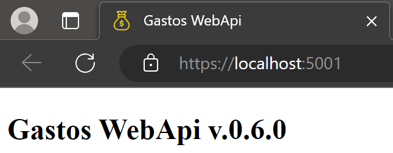
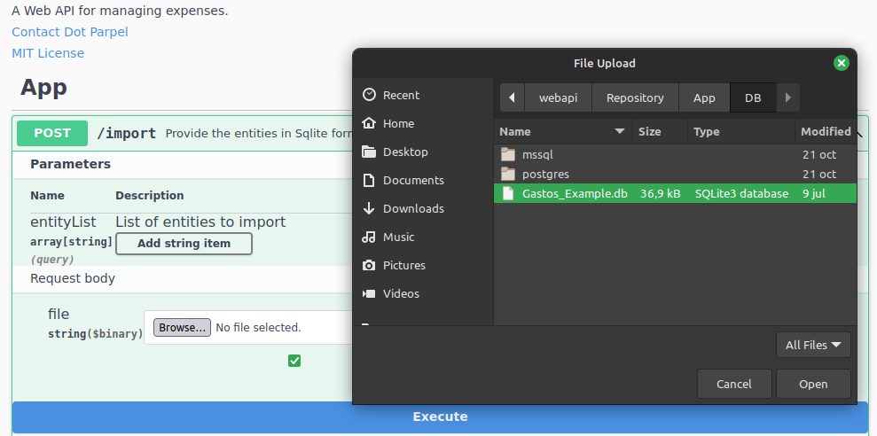
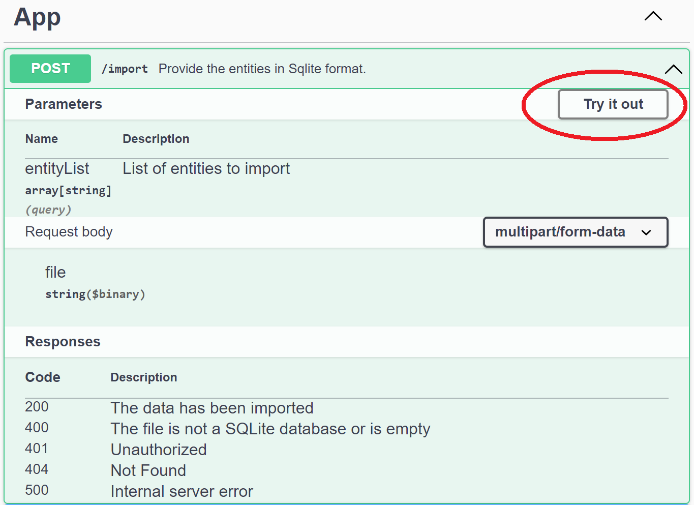
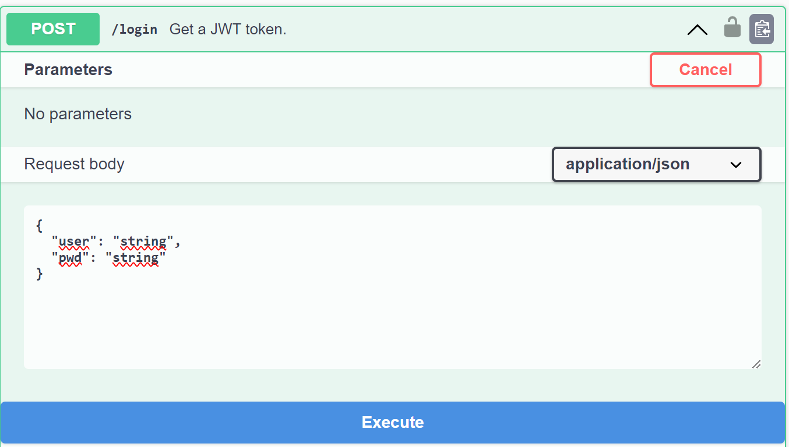

# Gastos_webapi
## Motivación

Este proyecto surge con el objectivo de que la aplicación para móvil que he desarrollado, [Dot Parpel Gastos](https://play.google.com/store/apps/details?id=cat.dotparpel.gastos), que hasta el momento guarda toda la información en local en una BD *SQLite*, pueda trabajar con datos en servidor a través de un WebApi. En el momento de escribir este documento la aplicación aún no está preparada para usar la WebApi.

## Tecnologías usadas

Esta WebApi usa las siguientes tecnologías:

| <!-- --> | Tecnología | 
|-|-|
| Lenguage | C# (Net Core 7) |
| Bases de datos | PostgreSQL o SQL-Server<br> InMemory (pruebas)<br> SQLite (sólo para importación / exportación de datos) |
| Descripción de la WebApi | Swagger / OpenApi |
| Acceso a datos | OData |
| Autenticación | JwtBearer (opcional) |
| *Framework* de pruebas | xUnit |

## Entorno de desarrollo

Para el desarrollo de la aplicación se ha usado:
| <!-- --> | Tecnología | 
|-|-|
| Sistemas operativos | Windows 10, Windows 11, Linux Mint 21 |
| Contenedor | Docker (bases de datos de desarrollo PosgreSQL / SQL-Server) |
| Entorno de desarrollo | Visual Studio Code, con las siguientes extensiones:<br>- [C#](https://marketplace.visualstudio.com/items?itemName=ms-dotnettools.csharp) <br>- [.NET Core Test Explorer](https://marketplace.visualstudio.com/items?itemName=formulahendry.dotnet-test-explorer)<br>- [Coverage Gutters](https://marketplace.visualstudio.com/items?itemName=ryanluker.vscode-coverage-gutters)<br> - [vscode-solution-explorer](https://marketplace.visualstudio.com/items?itemName=fernandoescolar.vscode-solution-explorer) |

Para la selección de estas herramientas las motivaciones han sido:
- Uso de estándares consolidados y multiplataforma siempre que sea posible
- Disponibilidad de las herramientas de desarrollo sin coste
- Uso bajo de recursos en la plataforma de despliegue destino
    - En particular, la aplicación destino deberá poder desplegarse y ejecutarse en una *Raspberry 4*

## Objetivos
El objetivo inicial ha sido, tal como se explica en el apartado motivación, dar soporte a la aplicación [Dot Parpel Gastos](https://play.google.com/store/apps/details?id=cat.dotparpel.gastos) para que pueda trabajar con datos en servidor.

Como objetivos secundarios pero no por ello menos relevantes:
- Facilidad de uso de la WebApi
- En la medida de lo posible, que la WebApi se autoexplique y permita pruebas (mediante *Swagger*)
- Proporcionar ejemplos de uso de la WebApi en la propia página *Swagger*
- Adición de nuevas entidades con (relativa) facilidad

Con estos objetivos en mente, la aplicación resultante presenta el siguiente aspecto:


## Descripción
La WebApi proporciona las siguientes funcionalidades:
* CRUD para entidades, en el proyecto `Category` y `Expense`, aceptando consultas OData en el método de lectura de listas (GET)
* Entidades únicamente de lectura de listas (`ExpenseExpanded` y `ExpenseReport`), usadas usualmente para la presentacion de información en desplegables, listas o informes
* Controlador `App` con funcionalidad propia de gestión y seguridad de la aplicación. Proporciona los siguientes metodos:
  - `login`: únicamente visible con la seguridad activada (ver el apartado [Configuración](#ConfiguracionId) más adelante), permite la introducción de credenciales y obtener, en caso de que sean válidas, un *token* de acceso y un *token* de refresco necesarios para usar la WebApi
  - `refreshToken`: únicamente visible con la seguridad activada, permite renovar un *token* de acceso caducado proporcionando un *token* de refresco. Típicamente se usa para evitar enviar las credenciales de usuario una vez caduque el *token* de acceso
  - `logout`: únicamente visible con la seguridad activada, indica a la WebApi que el usuario termina la sesión
  - `import`: importación de tablas proporcionando una base de datos *SQLite*. Para que la importación se produzca correctamente, el nombre y la estructura de la tabla a importar debe tener el mismo nombre y estructura en la base de datos destino, además de constar en el parámetro `ExportEntities`. Destacar que **los datos de la tabla destino serán <ins>substituidos</ins> por los proporcionados en la base de datos *SQLite***
  - `export`: exportación del contenido de la base de datos de la WebApi a una base de datos *SQLite*. Sólo se exportan las tablas indicadas en el parámetro `ExportEntities` del apartado `App` del fichero `appsettings.json`
  - `version`: devuelve el número de versión de la WebApi. Hay que tener presente que el número de versión del programa no tiene por qué coincidir con la versión de la interfície. Usado en determinados entornos para comprobar si la WebApi está disponible (por ejemplo, prueba de servicio alzado con *Nagios*)
* Controlador `User`: permite la gestión de usuarios autorizados a usar la WebApi. Por defecto no es accesible, todo y que se puede activar explícitamente a través de la configuración del `appsettings.json`

Inicialmente, el entorno de desarrollo (configurado en `appsettings.Development.json`) se proporciona con la **seguridad desactivada**, de forma que se permite la ejecución de los métodos de la WebApi sin tener que introducir credenciales. 
<br/><br/>
Para poder realizar pruebas immediatamente, se proporciona un fichero de datos 'Gastos_Example.db' situado en el directorio '\webapi\Repository\App\DB' con información sintética de pruebas. El mencionado fichero es una base de datos *SQLite* que se puede abrir con cualquier lector apto para ello (se puede descargar el gestor oficial en https://www.sqlite.org/download.html).

## Prueba del programa
La aplicación está configurada en el repositorio para que se pueda ejecutar una vez bajada en el entorno de desarrollo sin acciones prévias.

En la configuración del entorno de desarrollo por defecto (`appsettings.Development.json`) se parametriza que:
- La base de datos usada es *InMemory*, lo que implica que inicialmente está vacía y no serán persistidos los cambios que se hagan
- No hay seguridad asignada y se puede ejecutar sin proporcionar credenciales
- La aplicación se inicia en http://localhost:5000/ y presenta una interfície *Swagger* que permite realizar pruebas fácilmente

En la configuración del entorno de producción (`appsettings.json`), el programa se configura de la siguiente forma:
- La base de datos usada es una instancia de *PostgreSQL* localizada en 192.168.1.2 (se debe modificar por la dirección donde se halle el servidor *PostgreSQL*), y se puede crear a través del *script* `0001.sql` situado en la carpeta `Repository/App/DB/postgres` del proyecto WebApi
- Opcionalmente, se puede indicar que se usa una base de datos SQL-Server assignado en el apartado "ConnectionStrings" el campo "Active" al valor "MsSql" y introduciendo una cadena de conexión válida en el campo del mismo nombre. Para crear la base de datos SQL-Server se puede usar el *script* localizado en `Repository/App/DB/mssql`
- Para ejecutar los métodos de la WebApi es necesario proporcionar credenciales a través del método *login* del controlador *App*. En el *script* anterior, se configura un usuario *admin* con la contraseña *pwd*
- La aplicación se inicia en https://localhost:5001/ y no presenta la interfície *Swagger*, aunque se identifica a sí misma y indica su versión


<br><br>

En el apartado [Configuración](#ConfiguracionId) de esta pàgina se muestra como conseguir configuraciones intermedias para ejecutarse por ejemplo en un entorno de pruebas.

En cualquiera de los dos casos, se puede importar el pequeño fichero de pruebas *SQLite* `Gastos_Example.db` situado en la carpeta `Repository/App/DB` mediante el uso del método `import` del controlador `App`, tal como se muestra en la siguiente imagen:


<br><br>

Los pasos para realizar la importación son los siguientes:
1) En el apartado "App", pulsar con el ratón en el botón `POST /import`
2) Con la acción anterior, se despliega el contenido de la opción. Pulsar el botón "Try it out"



3) Al hacerlo, se muestra un botón "Browse" que permite seleccionar, en nuestro caso, la base de datos *SQLite* a importar


4) Una vez pulsado, se abre un formulario de diálogo que permite escoger el archivo a importar. Pulsamos el botón "Open"
5) Finalmente, se muestra el botón "Execute", que se muestra en la parte inferior de la imagen anterior con fondo azul. Lo pulsamos y con ello finalizamos la importación de datos

En los métodos *GET* de los controladores de datos (en el proyecto, los correspondientes a los apartados *Category* y *Expense*), además de los parámetros para construir la consulta añadidos por *Swagger*, se proporcionan enlaces rápidos de prueba que muestran algunas de las posibilidades de consulta proporcionadas por *OData*. 

Pulsando el enlace, se ejecuta la consulta correspondiente y se muestra el resultado en una nueva pestaña.


Finalmente, para activar la seguridad en el entorno de desarrollo, es necesario proporcionar una configuración del *token* JWT en el subapartado "App" -> "JWT". Como ya se proporciona una el en fichero de `appsettings.json`, lo más sencillo es eliminar el mencionado subapartado en `appsettings.Development.json`, que está destacada en la siguiente imágen:


Al ejecutar la WebApi en el entorno de desarrollo, si no se ha modificado el fichero de configuracion `appsettings.json` **no** se mostrarán los métodos `login`, `refreshToken` y `logout` en el apartado `App`.

Con la seguridad activada, al intentar ejecutar cualquier método no público, el programa mostrará un error `401 - Unauthorized`. Para usar el programa debe introducir credenciales, siguiendo los siguientes pasos:
1) Pulsar sobre el método `POST - /login` del apartado `App`
2) Una vez *Swagger* despliega la información y opciones del método, pulsar sobre el botón "Try it out"



3) Tal como se puede ver en la imagen anterior, se muestra en el apartado "Request body" un JSON con los campos "user" i "pwd". Introducimos como usuario "admin" y como contraseña "pwd", pulsando después el botón "Execute".
4) Si los datos son correctos, el programa debería responder mostrando un apartado "Responses" con un código de respuesta 200 y con un JSON con dos campos, "token_access" y "token_refresh"


5) Copiamos el contenido del campo "token_access" (sin las comillas que lo envuelven) y pulsamos el icono del candado abierto que se muestra en la parte derecha del método
6) *Swagger* abre una ventana con el título "Available autorizations", y explica como informar un *token* de tipo *Bearer*. Seguimos las instrucciones y escribimos en el campo "Value" de la ventana el texto "Bearer " (observar el espacio al final del texto) y pegamos el contenido del campo "token_access" que hemos copiado anteriormente. Seguidamente, pulsamos el botón "Authorize" y después "Close"


7) Ahora todos los candados abiertos de la página deberían haber cambiado por candados cerrados. Si ejecutamos cualquier método sobre las entidades de datos, deberían mostrar la información disponible. Atención, que por defecto el *token* tiene una caducidad por defecto de 30 min.

<div id="ConfiguracionId"></div>

## Configuración

En este apartado se procede a explicar las opciones de configuración de la WebApi disponibles a partir de la modificación del fichero `appsettings.json`.

Los apartados de configuración propios de la aplicación son los siguientes:
* `ConnectionStrings`
* `App`
* `Swagger`

El resto de apartados es común a todos los proyectos *.NET*, así que no se explican en este documento.

### ConnectionStrings

Se definen las cadenas de conexión con las que se puede configurar el programa y especificar la que está activa. La sección presenta el siguiente aspecto:

```
"ConnectionStrings": {
    "Active": "Postgres"
    , "InMemory": "Username=admin;Password=pwd"
    , "Postgres": "Host=192.168.1.2;Username=expenseuser;Password=expensepwd;Database=expenses_db"
  }
```

Donde el campo `Active` indica la cadena de conexión que usará el programa cuando se ejecute, especificandose a continuación del mismo una lista de propiedades que indican:
  * Una identificador de la cadena  
  * La cadena de conexión a usar por el programa

En la cadena correspondiente a "InMemory" sólo se especifican credenciales a usar en caso de ejecutar la WebApi con la seguridad activada (la configuracion de seguridad se explica en en siguiente apartado).

### App

Aquí se definen los parámetros de la aplicación. En el momento de escribir este documento, está configurada de la siguiente forma:

```
  , "App" : {
    "Title" : "Gastos WebApi"
    , "DbEncriptionKey" : "An_example_of_DbEncriptionKey"
    , "ApiVersion" : "v1"
    , "Jwt": {
        "Key": "An_example_of_JwtKey"
        , "Audience": "https://localhost:5001"
        , "Issuer": "https://localhost:5001"
        , "AccessTokenExpirationMinutes": 30
        , "RefreshExpirationMinutes": 1440
        // Should be <= than the length specifiend in the user entity in DB.
        , "RefreshKeyLength" : 64
      }
    , "UseSwaggerUI" : false
    , "ExcludeControllerMethods": ["App.Import", "User"]
    // Ordered ready to delete (entities that none depends on first).
    , "ExportEntities": ["Expense", "Category"]
  }
```

Cada uno de los parámetros tiene el siguiente uso:
* `Title`: título de la aplicación. Se muestra tanto en la página *Swagger* como en la autoidentificación del servicio cuando no se usa la página *Swagger*
* `DbEncriptionKey`: texto usado como clave para encriptación de campos en la base de datos. Actualmente sólo se usa en el campo de contraseña del usuario
* `ApiVersion`: versión de la interfície de la Api, que no tiene que coincidir con la versión del própio proyecto. Se usa como información, ya que el proyecto aún no da soporte a múltiples interfícies del servicio
* `Jwt`: parámetros relacionados con la gestión del *JSON Web Token*. Si se define una clave, el servicio provee de los métodos `login` y `token` para obtener y gestionar un *token*, y exige proporcionar el mismo en las llamadas a la WebApi. Caso contrario, se permite la ejecución de métodos sin autenticación y por defecto no se publican los métodos anteriores. De esta forma, es posible configurar el entorno de desarrollo sin seguridad y el entorno de producción con ella
* `UseSwaggerUI`: determina si se mostrará una página *Swagger*. Así, es posible que los entornos de desarrollo y pruebas / integración presenten la página *Swagger*, mientras que el entorno de producción no lo haga 
* `ExcludeControllerMethods`: lista de métodos / controladores que se excluyen de la API para que sean inaccesibles. En el fichero de configuración de la parte superior se excluye el método `import` del controlador `App` y tambien el controlador `User` en su totalidad. Con ello se consigue que en el entorno de producción no sea posible ni importar datos (destruyendo los existentes) ni realizar mantenimiento de usuarios
* `ExportEntities`: lista de entidades que serán importadas / exportadas por los métodos `import` y `export`

### Swagger

Finalmente, en este apartado se define parte del comportamiento, aspecto y contenido de la página *Swagger*, presentando el siguiente aspecto:

```
  , "Swagger" : {
    "UrlSampleRequest" : "https://localhost:5001/{ApiVersion}"
    , "PersistAuthorization" : false
    , "DefaultHttpMethodOrder" : [ "get", "post", "put", "patch", "delete", "options", "trace" ]
    , "MethodOrder" : ["App_login_POST", "App_refreshToken_POST", "App_logout_POST", "App_import_POST", "App_export_GET", "App_version_GET"]
    , "Definitions" : [
      {
        "DefinitionId" : "CategoryJson"
        , "Definition" : [
          "{"
          , "  \"cat_id\": 2, "
          , "  \"cat_desc\": \"Category description {Operation}\", "
          , "  \"cat_order\": 5"
          , "}"
        ]
      }
      ...
    ]
    , "SchemasToRedefine" : [
      {
        "Schema" : "CategoryDelta"
        , "Properties" : [
          {
            "Property" : "cat_desc"
            , "Type" : "string"
            , "Nullable" : true
          }
          , {
            "Property" : "cat_order"
            , "Type" : "integer"
            , "Nullable" : true
            , "Format" : "int32"
          }
        ]
      }
      ...
    ]
    , "Paths" : [
      {
        "Path"          : "/"
        , "Hide"        : true
      }
      , {
        "Path"          : "/version"
        , "Operation"   : "GET"
        , "Examples"  : [
          {
            "Content" : ["text/plain"]
            , "Example" : ["0.0.1"]
          }
        ]
      }
      ...
      , {
        "Path"          : "/Category"
        , "Operation"   : "GET"
        , "Description" : [
            "<strong>Sample requests:</strong>"
            , "<a href=\"[doclink]\">{UrlSampleRequest}/Category?$select=cat_id,cat_desc</a>"
            , "<a href=\"[doclink]\">{UrlSampleRequest}/Category?$filter=cat_id%20eq%202</a>"
            , "<a href=\"[doclink]\">{UrlSampleRequest}/Category?$filter=contains(cat_desc, 'e')</a>"
            , "<a href=\"[doclink]\">{UrlSampleRequest}/Category?$orderby=cat_order&amp;$top=2</a>"
            , "<a href=\"[doclink]\">{UrlSampleRequest}/Category?$expand=Expense</a>"
            , "<a href=\"[doclink]\">{UrlSampleRequest}/Category/$count</a>"
        ]
        , "Examples"  : [
          {
            "Content" : ["json", "text/plain", "application/octet-stream"]
            , "Example" : [
              "["
              , "  {"
              , "    \"cat_id\" : 1, "
              , "    \"cat_desc\": \"Category description GET 1\", "
              , "    \"cat_order\": 3"
              , "  },"
              , "  {"
              , "    \"cat_id\": 2, "
              , "    \"cat_desc\": \"Category description GET 2\", "
              , "    \"cat_order\": 4"
              , "  }"
              , "]"
            ]
          }
        ]
      }
      ...
    ]
  }
```

Cada uno de los campos del *JSON* tiene el siguiente significado:
- `UrlSampleRequest`: valor de la URL que será substituido en lugar del parámetro `[doclink]` en la descripción de los métodos. Tiene la utilidad de permitir que cuando se pulse un enlace de la descripción se ejecute el método del servicio
- `PersistAuthorization`: permite que se deba introducir una única vez las credenciales a lo largo de diferentes ejecuciones de la aplicación. Tiene sentido únicamente cuando se encuentre activada la seguridad mientras se está desarrollando
- `DefaultHttpMethodOrder`: orden por defecto en que se mostrarán los métodos HTTP de un controlador en la página *Swagger*
- `MethodOrder`: orden en que se muestran los métodos de un controlador
- `Definitions`: definición de *Jsons* de ejemplo comunes a diferentes métodos
- `SchemasToRedefine`: redefinición de esquemas mostrados por *Swagger*. Su existencia se debe a que en el momento de desarrollar el servicio, el método `patch` de los controladores mostraba un esquema poco intuitivo, tal como se muestra a continuación:
<br/>


- `Paths`: en este apartado se pueden configurar diferentes aspectos sobre como se muestra cada uno de los métodos en la pàgina *Swagger*
    - `Path`: ruta del servicio sobre la que se definen las propiedades
    - `Hide`: no mostrar el método
    - `Operation`: corresponde al método HTTP, ya que un *path* puede ser comun a dos operaciones diferentes. Por ejemplo, el *path* */Category* tiene dos operaciones asociadas, una para GET y otra para POST
    - `SchemaResponse`: esquema esperado de la respuesta
    - `Examples`: ejemplos que queremos proporcionar para un método del servicio. Para cada ejemplo podemos especificar:
      - `Content`: tipos HTTP de la respuesta
      - `Example`: descripción del ejemplo
      - `DefinitionId`: descripción del ejemplo definida en el apartado `Definitions` dentro del apartado `Swagger`
    - `Description`: descripción en formato HTML del ejemplo. Dentro de la descripción, el texto `[doclink]` se substituye por el texto especificado en `UrlSampleRequest`
    - `MessageType`: descripcion del contenido a pasar al método al llamarlo
    - `Summary`: texto de descripción del método

## Despliegue

Para la realización de pruebas, la aplicación se ha desplegado en un contenedor *Docker* emplazado en una *Raspberry 4*. El fichero de configuración usado és el siguiente:

```
# Download the Dot Net runtime.
FROM mcr.microsoft.com/dotnet/aspnet:7.0 AS base
WORKDIR /app
EXPOSE 5000

ENV ASPNETCORE_URLS=http://+:5000

# Download the Dot Net SDK.
FROM mcr.microsoft.com/dotnet/sdk:7.0 AS build

# Download the project from Git.
WORKDIR /src
RUN git config --global http.sslverify false
RUN git clone https://192.168.1.2:8081/net_gastos_webapi.git .

# Build the project.
WORKDIR /src/webapi/.
RUN dotnet restore "webapi.csproj"
RUN dotnet build "webapi.csproj" -c Release -o /app/build

# Publish the project.
FROM build AS publish
RUN dotnet publish "webapi.csproj" -c Release -o /app/publish /p:UseAppHost=false

FROM base AS final
WORKDIR /app

COPY --from=publish /app/publish .
ENTRYPOINT ["dotnet", "webapi.dll"]
```

Como se puede observar, la aplicación se descarga directamente del servidor *git* situado en la dirección https://192.168.1.2:8081/net_gastos_webapi.git. Si se desea adaptar esta configuración, se debe substituir esta dirección local por la que corresponda.

## Aspectos técnicos
La aplicación consta una solución .NET con dos proyectos:
- La propia WebApi situada en el directorio `webapi`
- Un proyecto de pruebas situado en el directorio `tests`

Se explican ambos a continuación:

### WebApi (directorio `webapi`)
El proyecto se basa fuertemente en tres controladores:
- `AppController` que proporciona los métodos de identificación, autenticación e importación / exportación de datos
- `GenericCRUDController` que permite el mantenimiento (alta / baja / modificación) de entidades
- `GenericSearchController` que permite la búsqueda de entidades

El resto de controladores de la WebApi se derivan de los dos últimos.

A su vez, los dos controladores genéricos usan las clases genéricas de acceso a datos:
- `GenericRepository`: dado un contexto, proporciona los métodos genéricos para realizar altas / bajas / modificaciones
- `GenericSearch`: búsqueda de datos

### Proyecto de pruebas (directorio `tests`)
En el projecto cabe destacar tres carpetas:
- `Client`: contiene código que puede usarse desde un cliente para autenticarse y ejecutar métodos de la WebApi
- `Tests`: código que ejecuta las pruebas
- `TestResults`: resultado de las pruebas, que una vez ejecutadas incluye un fichero `lcov.info` junto con un directorio `coveragereport` en donde reside el informe HTML generado por la utilidad [ReportGenerator](https://github.com/danielpalme/ReportGenerator)

## Ejecución de pruebas
* Para crear el fichero con los resultados de las pruebas, nos aseguramos que nos encontramos en el directorio `tests` y ejecutamos en la ventana de terminal el siguiente comando:

  `dotnet test -p:CollectCoverage=true -e:CoverletOutputFormat='lcov' -e:CoverletOutput='./TestResults/lcov.info'`

  Este comando crea un fichero lcov.info en el directorio *TestResults* del proyecto de pruebas *Tests*.

  En *Visual Studio Code*, con la extensión [Coverage Gutters](https://marketplace.visualstudio.com/items?itemName=ryanluker.vscode-coverage-gutters) podemos ver en cada uno de los ficheros del proyecto las partes que han sido probadas, destacandolas en verde en la parte izquierda del editor de código y mostrando el porcentaje de código probado en la parte inferior izquierda de la barra de estado del entorno.

  Si queremos obtener un informe de la cobertura de nuestras pruebas, podemos usar el [ReportGenerator](https://github.com/danielpalme/ReportGenerator) con el siguiente comando:
  
  `reportgenerator -reports:./TestResults/lcov.info -targetdir:./TestResults/coveragereport`

  Una vez ejecutado este comando desde el proyecto de prueba *Tests*, podemos abrir el informe desde el propio *Visual Studio Code* accediendo al fichero *index.htm* desde la carpeta *TestResults/coveragereport* con la opción *Show preview* que proporciona el propio entorno.

  Tal como se indica en la pàgina web de la herramienta, para instalar el [ReportGenerator](https://github.com/danielpalme/ReportGenerator) a nivel global y que esté disponible desde cualquier proyecto, podemos ejecutar en el terminal:

  `dotnet tool install -g dotnet-reportgenerator-globaltool`

## Mejoras pendientes
- Inclusión de un *logger*
- Añadir métodos de sincronización de datos entre una BD local y la BD de la WebApi
- Gestión de diferentes versiones de la misma WebApi
- Posibilidad de importar / exportar datos comprimidos (ZIP)