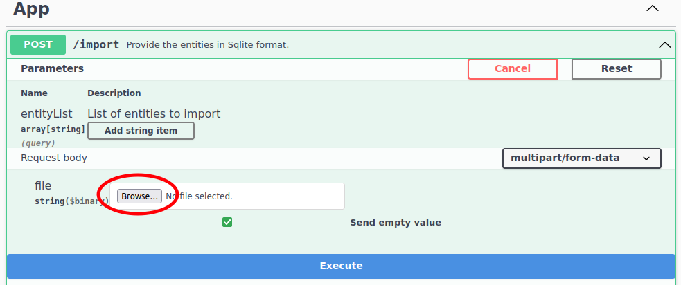
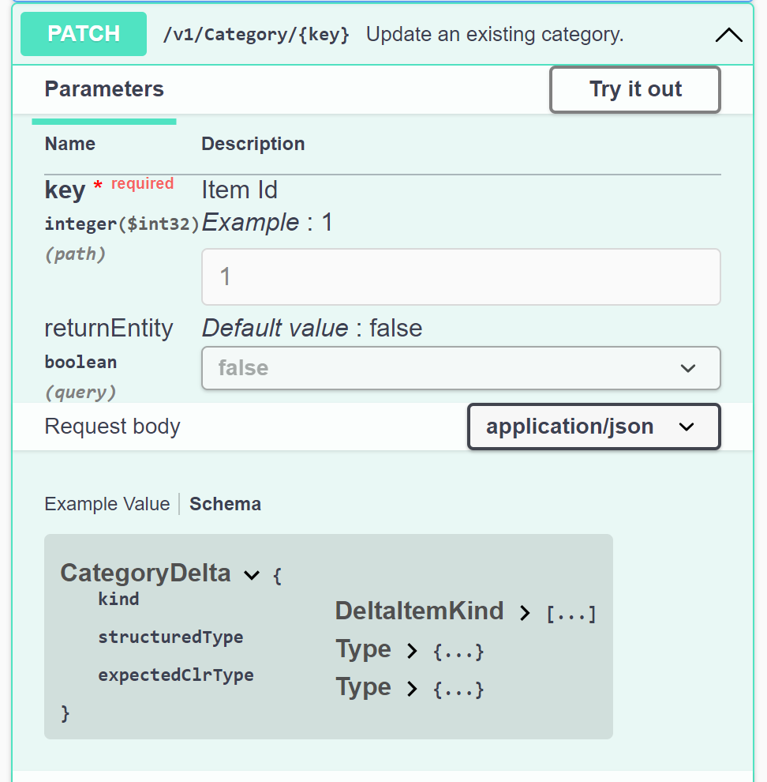

# Gastos_webapi
## Motivation

A time ago, I developed a mobile application, [Dot Parpel Gastos](https://play.google.com/store/apps/details?id=cat.dotparpel.gastos), that saves all the information locally in an *SQLite* DB. This project starts with the objective of allow the application to save the data on a server through a WebApi. At the time of writing this document the application is not yet ready to use the WebApi.

## Technologies used

This WebApi uses the following technologies:

| <!-- --> | Tecnología | 
|-|-|
| Language | C# (Net Core 7) |
| Databases | PostgreSQL or SQL-Server<br> InMemory (tests)<br> SQLite (only for data import/export) |
| WebApi description | Swagger / OpenApi |
| Data access | OData |
| Authentication | JwtBearer (optional) |
| Test *Framework* | xUnit |

## Development environment

For the development of the application I have used:
| <!-- --> | Tecnología | 
|-|-|
| Operating systems | Windows 10, Windows 11, Linux Mint 21 |
| Container | Docker (development databases PosgreSQL / SQL-Server) |
| Development environment | Visual Studio Code, with the following extensions:<br>- [C#](https://marketplace.visualstudio.com/items?itemName=ms-dotnettools.csharp) <br>- [.NET Core Test Explorer](https://marketplace.visualstudio.com/items?itemName=formulahendry.dotnet-test-explorer)<br>- [Coverage Gutters](https://marketplace.visualstudio.com/items?itemName=ryanluker.vscode-coverage-gutters)<br> - [vscode-solution-explorer](https://marketplace.visualstudio.com/items?itemName=fernandoescolar.vscode-solution-explorer) |

The motivations for the selection of these tools have been:
- Use of consolidated and cross-platform standards whenever possible
- Availability of development tools at no cost
- Low resource usage on the target deployment platform
     - In particular, the target application must be able to be deployed and run on a *Raspberry 4*

## Goals
The initial objective has been to allow the application [Dot Parpel Gastos](https://play.google.com/store/apps/details?id=cat.dotparpel.gastos) leave the data on the server.

Secondary objectives, but no less relevant:
- Ease of use of the WebApi
- As far as possible, let the WebApi explain itself and allow testing (using *Swagger*)
- Provide examples of use of the WebApi on the *Swagger* page itself
- Adding new entities with (relative) ease

With these goals in mind, the resulting application looks like this:


## Description
The WebApi provides the following functionalities:
* CRUD for entities, in the project `Category` and `Expense`, accepting OData queries in the list reading (GET) method
* Read-only entities (`ExpenseExpanded` and `ExpenseReport`), usually used for the presentation of information in dropdowns, lists or reports
* `App` controller with funcionality used in security and data management. Provides the following methods:
  - `login`: only visible with security activated (see the [Configuration](#ConfigurationId) section below), allows the introduction of credentials and obtain an access *token* and a refresh *token* necessary to use the WebApi
  - `refreshToken`: only visible with security activated, allows to renew an expired access *token* by providing a refresh *token*. Typically used to avoid sending user credentials once the access *token* expires
  - `logout`: only visible with security activated, indicates to the WebApi that the user ends the session
  - `import`: import data tables providing an *SQLite* database. The name and structure of the table to be imported must have the same name and structure in the WebApi database, in addition to being included in the `ExportEntities` parameter. Note that **the data in the destination table will be <ins>replaced</ins> by those provided in the *SQLite database***
  - `export`: export the contents of the WebApi database to an *SQLite* database. Only the tables indicated in the `ExportEntities` parameter of the `App` section of the `appsettings.json` file are exported.
  - `version`: returns the version number of the WebApi. Keep in mind that the version number of the program does not have to coincide with the version of the interface. Used in certain environments to check if the WebApi is available (e.g. monitoring with *Nagios*)
* `User` controller: allows the management of users authorized to use the WebApi. By default its not accessible, but can be activated explicitly through the `appsettings.json` configuration

Initially, the development environment (configured in `appsettings.Development.json`) is provided with **security disabled**, allowing WebApi methods to run without having to enter credentials.
<br/><br/>
In order to be able to perform tests immediately, a data file 'Gastos_Example.db' located in the directory '\webapi\Repository\App\DB' is provided with synthetic test information. The aforementioned file is a *SQLite* database that can be opened with any reader suitable for it (the official manager can be downloaded at https://www.sqlite.org/download.html).

## Program test
The application can be run once downloaded into the development environment without prior actions.

The default development environment configuration (`appsettings.Development.json`) is parameterized as follows:
- The database used is *InMemory*, which means that it is initially empty and any changes made will not be persisted
- Security is disabled and can be run without providing credentials
- The application starts at http://localhost:5000/ and presents a *Swagger* interface that allows easy testing

The production environment settings (`appsettings.json`) are mapped as follows:
- The database used is an instance of *PostgreSQL* located at 192.168.1.2 (you have to set your own server address). The *script* `0001.sql` is provided in the `Repository/App/DB/postgres` folder of the WebApi project, and can be used to create an empty database
- Optionally, you can indicate that a SQL-Server database is used by assigning the "Active" field to the value "MsSql" in the "ConnectionStrings" section and setting a valid connection string in the field of the same name. To create the SQL-Server database you can use the *script* located in `Repository/App/DB/mssql`
- To execute the WebApi methods it is necessary to provide credentials through the *login* method of the *App* controller. In the *scripts* above, a user *admin* is configured with the password *pwd*
- The application starts at https://localhost:5001/ and does not present the *Swagger* interface, although it identifies itself and indicates its version


<br><br>

The [Configuration](#ConfigurationId) section of this page shows how to obtain intermediate configurations to run, for example, in a test environment.

Anyway, you can import the small *SQLite* test file `Gastos_Example.db` located in the `Repository/App/DB` folder by using the `import` method of the `App` driver, as shown in the following image:


<br><br>

The steps to do the import are:
1) In the "App" section, click with the mouse on the `POST /import` button
2) With the previous action, the content of the option is displayed. Press the "Try it out" button


3) A "Browse" button is displayed that allows you to select, in our case, the *SQLite* database to import



4) Once clicked, a dialog form opens that allows you to choose the file to import. Press the "Open" button
5) Finally, the "Execute" button is displayed, shown at the bottom of the image above with a blue background. Press it to finish the data import

In the *GET* methods of the data controllers (in the project, those corresponding to the *Category* and *Expense* sections), in addition to the parameters to build the query added by *Swagger*, quick test links are provided which show some of the query possibilities provided by *OData*.

By clicking the link, the corresponding query is executed and the result is displayed in a new tab.


Finally, if you want to enable security in the development environment, you have to provide a JWT *token* configuration in the "App" -> "JWT" subsection. Since one is already provided in the `appsettings.json` file, you can eliminate the aforementioned subsection in `appsettings.Development.json`, which is highlighted in the following image:


When running the WebApi in the development environment, if the configuration file `appsettings.json` has not been modified (security is disabled), the `login`, `refreshToken` and `logout` methods will **not** be displayed in the `App` section.

With security enabled, when attempting to execute any non-public method, the program will display a `401 - Unauthorized` error. To use the program you need provide credentials, following the following steps:
1) Click on the `POST - /login` method of the `App` section
2) Once *Swagger* displays the information and options of the method, click on the "Try it out" button


3) As you can see in the previous image, a JSON with the fields "user" and "pwd" is displayed in the "Request body" section. Enter "admin" as the user and "pwd" as the password, then press the "Execute" button.
4) If the data is correct, the program should respond by showing a "Responses" section with a response code 200 and a JSON with two fields, "token_access" and "token_refresh"


5) Copy the content of the "token_access" field (without the quotes surrounding it) and click on the open padlock icon shown on the right side of the method
6) *Swagger* opens a window with the title "Available authorizations", and explains how to set a *token* of type *Bearer*. Follow the instructions and write the text "Bearer " in the "Value" field of the window (note the space at the end of the text) and paste the content of the "token_access" field that you copied previously. Next, press the "Authorize" button and then "Close"


7) Now all open locks on the page should have changed to closed locks. If you run any method on the data entities, they should display the available information. Beware, the *token* has a default expiration of 30 min. by default

<div id="ConfiguracionId"></div>

## Setting

This section explains the WebApi configuration options available modifying the `appsettings.json` file.

The configuration sections of the application are below:
* `ConnectionStrings`
* `App`
* `Swagger`

The rest of the sections are common to all *.NET* projects, so they are not explained in this document.

### ConnectionStrings

Connection strings are defined with which you can configure the program and specify which one is active. The section looks like this:

```
"ConnectionStrings": {
    "Active": "Postgres"
    , "InMemory": "Username=admin;Password=pwd"
    , "Postgres": "Host=192.168.1.2;Username=expenseuser;Password=expensepwd;Database=expenses_db"
  }
```

Where the `Active` field indicates the connection string that the program will use when it is executed, specifying after it a list of properties that indicate:
   * A string identifier
   * The connection string to use by the program

In the string corresponding to "InMemory" only credentials are specified to be used in case of executing the WebApi with security activated (the security configuration is explained in the next section).

### App

Here the parameters of the application are defined. At the time of writing this document, it is configured as follows:

```
  , "App" : {
    "Title" : "Gastos WebApi"
    , "DbEncriptionKey" : "An_example_of_DbEncriptionKey"
    , "ApiVersion" : "v1"
    , "Jwt": {
        "Key": "An_example_of_JwtKey"
        , "Audience": "https://localhost:5001"
        , "Issuer": "https://localhost:5001"
        , "AccessTokenExpirationMinutes": 30
        , "RefreshExpirationMinutes": 1440
        // Should be <= than the length specifiend in the user entity in DB.
        , "RefreshKeyLength" : 64
      }
    , "UseSwaggerUI" : false
    , "ExcludeControllerMethods": ["App.Import", "User"]
    // Ordered ready to delete (entities that none depends on first).
    , "ExportEntities": ["Expense", "Category"]
  }
```

Each of the parameters has the following use:
* `Title`: title of the application. Displayed on both the *Swagger* page and the service greeting when the *Swagger* page is not used
* `DbEncriptionKey`: text used as a key for encryption of fields in the database. Currently only used in the user password field
* `ApiVersion`: version of the API interface, which does not have to match the version of the project itself. It is used as information, since the project does not yet support multiple service interfaces
* `Jwt`: parameters related to the management of the *JSON Web Token*. If a key is defined, the service provides the `login` and `token` methods to obtain and manage a *token*, and requires providing it in calls to the WebApi. Otherwise, the execution of methods without authentication is allowed and the previous methods are not published. So it is possible to configure the development environment without security and the production environment with it
* `UseSwaggerUI`: determines whether a *Swagger* page will be displayed. Thus, it is possible that the development and test/integration environments present the *Swagger* page, while the production environment does not
* `ExcludeControllerMethods`: list of methods/controllers that are excluded from the API to make them inaccessible. In the configuration file at the top, the `import` method of the `App` controller is excluded, as well as the `User` controller entirety. This means that in the production environment it is not possible to import data (destroying existing data) or perform user maintenance.
* `ExportEntities`: list of entities that will be imported/exported by the `import` and `export` methods

### Swagger

Finally, this section defines part of the behavior, appearance and content of the *Swagger* page, presenting the following appearance:

```
  , "Swagger" : {
    "UrlSampleRequest" : "https://localhost:5001/{ApiVersion}"
    , "PersistAuthorization" : false
    , "DefaultHttpMethodOrder" : [ "get", "post", "put", "patch", "delete", "options", "trace" ]
    , "MethodOrder" : ["App_login_POST", "App_refreshToken_POST", "App_logout_POST", "App_import_POST", "App_export_GET", "App_version_GET"]
    , "Definitions" : [
      {
        "DefinitionId" : "CategoryJson"
        , "Definition" : [
          "{"
          , "  \"cat_id\": 2, "
          , "  \"cat_desc\": \"Category description {Operation}\", "
          , "  \"cat_order\": 5"
          , "}"
        ]
      }
      ...
    ]
    , "SchemasToRedefine" : [
      {
        "Schema" : "CategoryDelta"
        , "Properties" : [
          {
            "Property" : "cat_desc"
            , "Type" : "string"
            , "Nullable" : true
          }
          , {
            "Property" : "cat_order"
            , "Type" : "integer"
            , "Nullable" : true
            , "Format" : "int32"
          }
        ]
      }
      ...
    ]
    , "Paths" : [
      {
        "Path"          : "/"
        , "Hide"        : true
      }
      , {
        "Path"          : "/version"
        , "Operation"   : "GET"
        , "Examples"  : [
          {
            "Content" : ["text/plain"]
            , "Example" : ["0.0.1"]
          }
        ]
      }
      ...
      , {
        "Path"          : "/Category"
        , "Operation"   : "GET"
        , "Description" : [
            "<strong>Sample requests:</strong>"
            , "<a href=\"[doclink]\">{UrlSampleRequest}/Category?$select=cat_id,cat_desc</a>"
            , "<a href=\"[doclink]\">{UrlSampleRequest}/Category?$filter=cat_id%20eq%202</a>"
            , "<a href=\"[doclink]\">{UrlSampleRequest}/Category?$filter=contains(cat_desc, 'e')</a>"
            , "<a href=\"[doclink]\">{UrlSampleRequest}/Category?$orderby=cat_order&amp;$top=2</a>"
            , "<a href=\"[doclink]\">{UrlSampleRequest}/Category?$expand=Expense</a>"
            , "<a href=\"[doclink]\">{UrlSampleRequest}/Category/$count</a>"
        ]
        , "Examples"  : [
          {
            "Content" : ["json", "text/plain", "application/octet-stream"]
            , "Example" : [
              "["
              , "  {"
              , "    \"cat_id\" : 1, "
              , "    \"cat_desc\": \"Category description GET 1\", "
              , "    \"cat_order\": 3"
              , "  },"
              , "  {"
              , "    \"cat_id\": 2, "
              , "    \"cat_desc\": \"Category description GET 2\", "
              , "    \"cat_order\": 4"
              , "  }"
              , "]"
            ]
          }
        ]
      }
      ...
    ]
  }
```

Each of the *JSON* fields has the following meaning:
- `UrlSampleRequest`: URL value that will be substituted instead of the `[doclink]` parameter in the methods description. It allows the service method to be executed when a link in the description is clicked
- `PersistAuthorization`: allows credentials to be entered only once across different executions of the application. It only makes sense when security is enabled while developing
- `DefaultHttpMethodOrder`: order in which a controller's HTTP methods will be displayed on the *Swagger* page
- `MethodOrder`: order in which the methods of a controller are displayed
- `Definitions`: definition of example *Jsons* common to different methods
- `SchemasToRedefine`: redefinition of schemas displayed by *Swagger*. Its existence is due to the fact that at the time of developing the service, the `patch` method of the controllers showed an unintuitive scheme, as shown below:
<br/>


- `Paths`: in this section you can configure different aspects of how each of the methods is displayed on the *Swagger* page
    - `Path`: service path on which properties are defined
    - `Hide`: do not show the method
    - `Operation`: corresponds to the HTTP method, since a *path* can be common to two different operations. For example, the *path* */Category* has two operations associated with it, one for GET and one for POST
    - `SchemaResponse`: expected schema of the response
    - `Examples`: examples that you want to provide for a method of the service. For each example you can specify:
      - `Content`: HTTP response types
      - `Example`: description of the example
      - `DefinitionId`: description of the example defined in the `Definitions` section within the `Swagger` section
    - `Description`: description in HTML format of the example. Within the description, the text `[doclink]` is replaced by the text specified in `UrlSampleRequest`
    - `MessageType`: description of the content to be passed to the method when calling it
    - `Summary`: method description text

## Deployment

For testing, the application has been deployed in a *Docker* container located on a *Raspberry 4*. The configuration file used is the following:

```
# Download the Dot Net runtime.
FROM mcr.microsoft.com/dotnet/aspnet:7.0 AS base
WORKDIR /app
EXPOSE 5000

ENV ASPNETCORE_URLS=http://+:5000

# Download the Dot Net SDK.
FROM mcr.microsoft.com/dotnet/sdk:7.0 AS build

# Download the project from Git.
WORKDIR /src
RUN git config --global http.sslverify false
RUN git clone https://192.168.1.2:8081/net_gastos_webapi.git .

# Build the project.
WORKDIR /src/webapi/.
RUN dotnet restore "webapi.csproj"
RUN dotnet build "webapi.csproj" -c Release -o /app/build

# Publish the project.
FROM build AS publish
RUN dotnet publish "webapi.csproj" -c Release -o /app/publish /p:UseAppHost=false

FROM base AS final
WORKDIR /app

COPY --from=publish /app/publish .
ENTRYPOINT ["dotnet", "webapi.dll"]
```

As you can see, the application is downloaded directly from the *git* server located at the address https://192.168.1.2:8081/net_gastos_webapi.git. If you wish to adapt this configuration, you have to replace the local address with your own.

## Technical aspects
The application consists of a .NET solution with two projects:
- The WebApi itself located in the `webapi` directory
- A test project located in the `tests` directory

Both are explained below:

### WebApi (`webapi` directory)
The project relies heavily on three controllers:
- `AppController` which provides identification, authentication and data import/export methods
- `GenericCRUDController` that allows maintenance (CRUD) of entities
- `GenericSearchController` which allows entity search

The rest of the WebApi controllers are derived from the last two.

The two generic drivers use the generic data access classes:
- `GenericRepository`: given a context, provides the generic methods to perform CRUD
- `GenericSearch`: data search

### Tests project (`tests` directory)
You can see three folders in the project:
- `Client`: contains code that can be used from a client to authenticate and execute WebApi methods
- `Tests`: code that executes the tests
- `TestResults`: results of the tests, which once executed include a file `lcov.info` along with a directory `coveragereport` where the HTML report generated by the utility [ReportGenerator](https://github.com/danielpalme/ReportGenerator) resides

## Testing execution
* To create the file with the test results, you have to assure that you are in the `tests` directory and execute the following command in the terminal window:

  `dotnet test -p:CollectCoverage=true -e:CoverletOutputFormat='lcov' -e:CoverletOutput='./TestResults/lcov.info'`

  This command creates a lcov.info file in the *TestResults* directory of the *Tests* test project.

  In *Visual Studio Code*, with the extension [Coverage Gutters](https://marketplace.visualstudio.com/items?itemName=ryanluker.vscode-coverage-gutters) you can see in each of the project files the parts that have been tested, highlighting them in green on the left side of the code editor and displaying the percentage of code tested at the bottom left of the environment status bar.

  If you want to obtain a report of the coverage of our tests, you can use the [ReportGenerator](https://github.com/danielpalme/ReportGenerator) with the following command:
  
  `reportgenerator -reports:./TestResults/lcov.info -targetdir:./TestResults/coveragereport`

  Once this command has been executed from the *Tests* project, you can open the report from *Visual Studio Code* by accessing the *index.htm* file from the *TestResults/coveragereport* folder with the *Show preview* option that provides the environment itself.

  As indicated on the tool's website, to install [ReportGenerator](https://github.com/danielpalme/ReportGenerator) globally and make it available from any project, you can execute in the terminal:

  `dotnet tool install -g dotnet-reportgenerator-globaltool`

## Pending improvements
- Inclusion of a *logger*
- Add data synchronization methods between a local database and the WebApi database
- Management of different versions of the same WebApi
- Ability to import/export compressed data (ZIP)